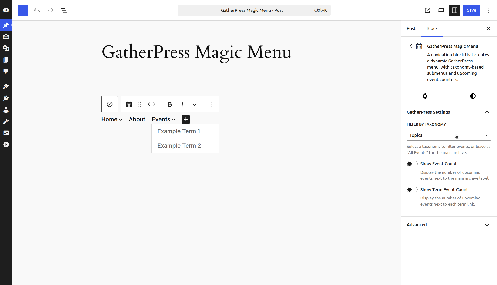

# GatherPress Magic Menu

**Contributors:**      carstenbach & WordPress Telex  
**Tags:**              block, navigation, gatherpress, events, taxonomy  
**Tested up to:**      6.8  
**Stable tag:**        0.1.0  
**License:**           GPLv2 or later  
**License URI:**       <https://www.gnu.org/licenses/gpl-2.0.html>  

A navigation block that creates a dynamic GatherPress menu, with taxonomy-based submenus and upcoming event counters.

 

---

## Description

The GatherPress Magic Menu block adds a navigation item to your site's navigation that links to your events archive. It can optionally create submenus based on GatherPress taxonomy terms of the upcoming events (Topics, Venues, or custom taxonomies), with each term becoming a submenu item.

The block integrates with WordPress's native Navigation block and inherits its styling. It includes performance optimizations through transient caching and automatic cache invalidation when events are published, unpublished, or their taxonomy terms change.

||||
|---|---|---|
||||

**Core Features:**

* Links to the GatherPress events post type archive
* Prevents navigation to archive when no upcoming events exist
* Customizable Link-Text, if unset uses translated post type plural from GatherPress core (translated into 11 languages already)
* Optional: Display upcoming event counts next to labels
* Three visual styles for event count display:
    * default (12)
    * badge⓬
    * starburst ⓬
* Optional: taxonomy-based submenus (one level deep)
* Automatic cache management (7-day expiry, invalidated on event changes)
* Works only inside Navigation blocks
* Clean-up on plugin deactivation

**Block Structure:**

* uses WordPress' core **Block Hooks API** for automated setup after plugin activation
* Parent block: `core/navigation`
* Renders as: `core/navigation-link` or `core/navigation-submenu` depending on the block settings
* Inherits navigation block styling
* uses WordPress' core **HTML Processor API** for attribute manipulation

**Event Counting:**

* Main archive link can show total upcoming events count
* Submenu term links can show per-term upcoming events count
* Event counts are calculated and cached for performance
* Counts update automatically when event status or terms change

**Caching Behavior:**

* Upcoming events query results cached for 7 days
    * If "GatherPress Cache Invalidation Hooks" plugin is active, the data for upcoming events is coming from a fresh DB option. In this case the "GatherPress Magic Menu" does neither query for events, nor persisting anything. The DB option is updated whenever an event reaches its event-end-time.
* Taxonomy term data cached separately per taxonomy
* Caches cleared when:
    * Event post status changes to/from 'publish'
    * Terms are assigned to or removed from events

## Usage Examples

Example 1: Simple Events Link

| with Events | without Events   |
|---|---|
|  |  |

Add the block to your navigation with no taxonomy selected. This creates a single link to your events archive with a disabled state when no upcoming events exist.

**Settings:** (100% default)

* Filter by Taxonomy: All Events

**Result:** "Events" linking to your events archive or showing as disabled link.

---

Example 2: upcoming Event Topics incl. counter

 

Create a submenu from GatherPress Topics terms of the upcoming events.

**Settings:**

* Filter by Taxonomy: Topics
* Show Event Count: Enabled (shows total for main link)
* Show Term Event Count: Enabled (shows count per topic)

**Result:**

* Events (12)
    * Code Review (3)
    * Social Meetup (5)
    * Workshop (4)

---

Example 3: upcoming Event Venues

 

Create a submenu from GatherPress Venues of the upcoming events.

**Settings:**

* Filter by Taxonomy: Venues
* Show Event Count: Disabled
* Show Term Event Count: Disabled

**Result:**

* Events
    * Community Center
    * Downtown Library
    * Online

---

Example 4: Styled Event Counts

| default | badge  | starburst |
|---|---|---|
|  |  |  |

Use block styles to visually emphasize event counts. The "badge" block style displays the count as a small notification indicator, while "starburst" uses a more prominent circular design.

**Settings:**

* Show Event Count: Enabled
* Block Style: Badge

**Result:**

* Events ⓬

---

## Frequently Asked Questions

### Does this require GatherPress?

Yes, the block is designed for GatherPress event post types only.

### What happens when there are no upcoming events?

The link to the events archive is displayed with `aria-disabled="true"` and styled to indicate it's disabled. JavaScript prevents clicks on the link.

### Can I customize which taxonomies appear?

The block shows all taxonomies registered with the `gatherpress_event` post type. You select one taxonomy per block instance in the block settings.

### How deep do submenus go?

Submenus are one level deep. Each term in the selected taxonomy becomes a submenu item. Nested term hierarchies are flattened.

### Can I use multiple instances?

Yes. You can add multiple GatherPress Magic Menu blocks to the same or different navigation menus, each configured differently.

### How often do event counts update?

Caches expire after 7 days but are automatically cleared when:

* An event is published or unpublished  
* Terms are added to or removed from events

### Can I clear the cache manually?

No, the cache clears automatically. To force a refresh, temporarily unpublish and republish an event.

## Ideas for later

### User Experience

* [ ] Block Preview: Add a more realistic preview in the editor that shows actual term names (not just placeholders) when a taxonomy is selected, so editors can see what will render.
* [ ] Empty State Messaging: When no upcoming events exist, consider showing an admin notice in the editor explaining why the link will be disabled.
* [ ] Taxonomy Validation: Add validation to check if the selected taxonomy still exists/is still registered with gatherpress_event and show a warning if not.

### Features

* [ ] Term Ordering: Add options for custom term ordering (alphabetical, by event count, by term order).
* [ ] Maximum Terms: Add option to limit the number of terms shown (with a "View All" link if needed).
* [ ] Hierarchical Terms: If taxonomies support hierarchical terms, add support for nested submenus.

### Testing & Documentation

* [ ] Unit Tests: Add unit tests for the renderer class methods, especially caching logic and count calculations.
* [ ] Developer Hooks: Expose filter hooks for developers to modify queries, cache keys, or output before rendering.

## Installation

1. Upload plugin files to `/wp-content/plugins/gatherpress-magic-menu/` or install via WordPress plugins screen
2. Activate the plugin
3. The block hooks itself into `core/navigation` blocks
4. Open the site editor, select your Navigation block, and find "GatherPress Magic Menu" already in place
5. Configure the block settings in the sidebar

## Changelog

### 0.1.0

* Initial release
* Navigation link to GatherPress events archive
* Optional taxonomy-based submenus
* Event count display for archive and term links
* Three block styles: default, badge, starburst
* Transient caching with automatic invalidation
* Disabled state when no upcoming events
* Integration with WordPress Navigation block

